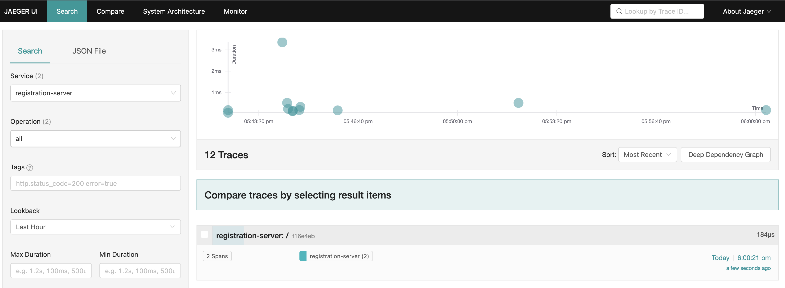

# Notes

**Assumption:** You have a Nomad/Vault/Consul HashiCorp environment running in a DC or locally using [HashiQube](https://github.com/avillela/hashiqube) set up. These jobspecs are set up assuming you are running Nomad locally via HashiQube. Please update accordingly for a setup in a Data Center.

## Converstion Process from Helm to Jobspec Template

This conversion was started by using the Tracetest Helm chart output to create the Tracetest jobspecs.

1. Render helm charts:

    ```bash
    helm repo add kubeshop https://kubeshop.github.io/helm-charts
    helm repo update
    helm template tracetest kubeshop/tracetest > tracetest.yaml
    ```

2. Base64 decode k8s secrets:

    ```bash
    # postgrest-password
    echo bEtjeTdlWHRIdg== | base64 -d

    # password
    echo bm90LXNlY3VyZS1kYXRhYmFzZS1wYXNzd29yZA== | base64 -d
    ```

## Deploying Tracetest on Nomad

1. Start up [hashiqube](https://github.com/avillela/hashiqube)

2. Update `/etc/hosts`

    Add the following entries:

    ```text
    192.168.56.192  tracetest.localhost
    192.168.56.192  postgres.localhost
    192.168.56.192  jaeger-ui.localhost
    192.168.56.192  jaeger-grpc.localhost
    192.168.56.192  jaeger-proto.localhost
    192.168.56.192  go-server.localhost
    ```

    This will allow Nomad on HashiQube to access the various services required for Tracetest.

3. Deploy to Nomad

    Please ensure that you deploy the jobspecs in this order:

    ```bash
    # Traefik with HTTP and gRPC enabled
    nomad job run jobspec/traefik.nomad

    # PostgreSQL DB required by Tracetest
    nomad job run jobspec/postgres.nomad

    # Jaeger tracing backend, supported by Tracetest
    nomad job run jobspec/jaeger.nomad

    # Go server app (this one can take a while to deploy)
    nomad job run jobspec/go-server.nomad

    # OTel Collector
    nomad job run jobspec/otel-collector.nomad

    # Tracetest
    nomad job run jobspec/tracetest.nomad
    ```
    
    >**NOTE:** If you run into issues deploying any of these, see [Gotchas](#gotchas) section for other gotchas and how to troubleshoot them.

4. Check the PostgreSQL connection

    To check the PostgreSQL connection, we need to install the `pg_isready` utility, which is available when you install PostgreSQL. See reference [here](https://stackoverflow.com/a/46703723).

    ```bash
    brew install postgres
    brew tap homebrew/services

    # Check that postgres isn't running, since we don't want it running locally
    brew services list
    ```

    >**NOTE:** This downloads and installs PostgreSQL on your Mac, but doesn't run the service. We just want to use the `pg_isready` util to make sure that we can connect to our DB.

    Now we can test our connection. More info [here](https://stackoverflow.com/a/44496546).

    ```bash
    pg_isready -d tracetest -h postgres.localhost -p 5432 -U tracetest
    ```

5. Make sure that the Jaeger query service is up and running

    Check gRPC endpoint (used by Tracetest)

    ```bash
    brew install grpcurl
    grpcurl --plaintext jaeger-grpc.localhost:7233 list
    ```

    >**NOTE:** We exposed port `7233` in Traefik, which maps to Jaeger gRPC container port `16685`.

    The Jaeger UI can accessed here: `http://jaeger-ui.localhost`

6. Make sure that Tracetest is up and running

    Go to the Tracetest UI here: `http://tracetest.localhost`

7. Access the sample app

    ```bash
    curl http://go-server.localhost
    ```

## Make Sure that Tracetest is Working

To test this setup, you must first send a trace to Jaeger, at `http://jaeger-ui.localhost`. We do that by calling our API endpont, `http://go-server.localhost`, from the sample Go server app. Tracetest will then pull the endpoint's traces from Jaeger.

1. Call the API endpoint

    ```bash
    curl http://go-server.localhost
    ```

    Check that the trace shows up in Jaeger. It will show up under service name `registration-server`.

    

2. Create the test

    Click the `Create Test` button on the top right, which will bring up the following:

    

    Fill out the following details:

    * Request Type: `GET`
    * URL: `http://go-server.localhost`
    * Name: `Go Server`

    Click `Create` when done.

    


    If all goes well, you'll see something like this:

    

    Congrats! Tracetest is running on Nomad!

## Troubleshooting

You can troubleshoot Tracetest by querying the database.

>**NOTE:** The `psql` command-line tool is available when you install PostgreSQL as per Step 4 in `Running the Jobspecs`.

1. Log into the database

    ```bash
    psql -h postgres.localhost -d tracetest -U tracetest -W
    ```

    You will be prompted for the password, which is `not-secure-database-password`

2. Inspect runs.

    > **NOTE:** To get run the ID from `stdout` Tracetest log. Sample log message:

    ```
    2022/06/07 19:19:06 GET /api/tests/79e74617-e709-4113-a5a6-b334140c358e/run/dbefe9f9-ba90-421c-bac3-436165a99d3d GetTestRun 1.248909ms
    ```

    Specifically, we're interested in this part:

    ```
    /api/tests/{test_id}/run/{run_id}
    ```

    From our sample log, `{run_id}` is `dbefe9f9-ba90-421c-bac3-436165a99d3d`

    Now you can run the query:

    ```sql
    select run from runs where id = '{run_id}';
    ```

## Gotchas

### Deploying the Go Server

The Go Server app can take a while to deploy and sometimes fails to pull the image. If that happens, please re-try.

### Communications between OTel Collector and Jaeger and/or Jaeger and Tracetest

Sometimes the OTel Collector has trouble sending data to Jaeger, even though everything appears to be up and running.

Sometimes, even when data is sent to Jaeger, Tracetest can't seem to find the traces.

>**NOTE:** I have no idea why this happens, but this does seem to fix things. You may need to re-try a few times. I would love to know why it can be finicky like this.

If you encounter either of the above scenarios, purge the Jaeger, Tracetest, and OTel Collector jobs and re-deploy as per below:

1. Purge jobs

    ```bash
    nomad job stop -purge tracetest
    nomad job stop -purge jaeger
    nomad job stop -purge otel-collector
    ```

2. Re-deploy Jaeger and the OTel Collector

    ```bash
    nomad job run jobspec/jaeger.nomad
    nomad job run jobspec/otel-collector.nomad
    ```

3. Send traces to Jaeger

    ```bash
    curl http://go-server.localhost
    ```

4. Check to see that traces are being sent to Jaeger

5. Re-deploy Tracetest

    ```bash
    nomad job run jobspec/tracetest.nomad
    ```

    Create your test
